# sweetbook-task-inseok

서비스 소개: 선생님이 학급 사진과 글을 한 권으로 묶어, 학생들에게 건네는 졸업·학년 마무리용 포토북을 만들고 인쇄까지 이어 가는 서비스입니다.

타겟 고객: 일년 동안의 추억을 담아 학생들에게 선물하고 싶은 선생님입니다.

주요 기능

- 회원가입·로그인(JWT)과 역할 구분(일반 `user` / `admin`)을 둡니다.
- 충전 잔액(`balance_won`)으로 충전 후 구매 시 차감합니다.
- 포토북 생성·목록·상세, 표지/내지 업로드, 최종화(SweetBook 연동)를 제공합니다.
- 이용자가 최종화한 책을 구매할 때 인쇄 비용을 산출하고, 충전 잔액으로 결제합니다.
- 구매 요청 후 관리자 승인 시 SweetBook 주문을 생성하고, 이용자는 요청 목록·취소를 할 수 있습니다.
- 관리자는 구매 요청 처리, 회사 크레딧 조회, 레이아웃 템플릿 등록을 합니다.
- 등록된 템플릿 UID를 기준으로 표지·내지 선택 UI를 보여 줍니다.

## 기술 스택

| 구분 | 사용 기술 |
|------|-----------|
| 프론트엔드 | Next.js 16, React 19, TypeScript, axios |
| 백엔드 | NestJS 11, TypeScript |
| ORM·DB | TypeORM, MySQL |

## 실행 방법

참고 — 시드 계정 (`backend/.env`가 `.env.example`과 같고 `npm run seed`를 실행한 경우)

| 구분 | 로그인 ID(이메일) | 비밀번호 |
|------|-------------------|----------|
| 관리자 | `testadmin123@naver.com` | `test123@` |
| 이용자 | `testuser123@naver.com` | `test123@` |

내부 사용자 UUID는 관리자 `00000000-0000-4000-a000-000000000001`, 이용자 `00000000-0000-4000-a000-000000000002` 입니다. `SEED_*` 값을 바꾼 경우 로그인 정보도 그에 맞게 달라집니다.

### 1) MySQL

백엔드는 MySQL에 연결합니다. 이미 로컬에서 MySQL이 실행 중이면 그것을 쓰면 되고, 그렇지 않으면 저장소의 Docker Compose로 MySQL만 띄울 수 있습니다.

```bash
cd ./backend

# mysql이 켜져있지 않다면
docker compose up -d mysql
```

- 기본 포트: 호스트 `3306` → 컨테이너 `3306` (`MYSQL_PUBLISH_PORT`로 바꿀 수 있음)
- 계정·DB 이름은 `backend/docker-compose.yml` / `.env`와 맞춰 `backend/.env`의 `DB_*` 를 설정합니다.

### 2) 백엔드

DB가 떠 있는 상태에서, 백엔드 디렉터리에서 다음을 실행합니다.

```bash
cd ./backend

cp .env.example .env
# .env 파일에 API Key 입력
```

`.env.example`을 그대로 복사해 두었으면 `SWEETBOOK_API_KEY`만 채워 넣으면 됩니다. 나머지는 예시에 맞춰져 있습니다.

주의: 본 웹 서비스는 SweetBook에서 제공하는 내 템플릿 기능을 사용합니다. 사용하는 API 키(파트너 환경)가 다르면 템플릿 목록이 달라질 수 있어, 이 저장소의 시드·`.env.example`에는 고정 템플릿(표지·내지 UID)만 넣어 두었습니다.

```bash
npm install

npm run start:dev
```

### 3) 시드 데이터 삽입 (새 터미널)

```bash
cd ./backend

npm run seed
```

- API 기본 주소: `http://localhost:3001` (`PORT`로 변경 가능)

### 4) 프론트엔드 (새 터미널)

```bash
cd ./frontend

cp .env.example .env
```

(백엔드 주소가 다르면 `.env`의 `NEXT_PUBLIC_API_BASE_URL`을 수정합니다.)

```bash
npm install
npm run dev
```

- 브라우저: `http://localhost:3000`

## 사용한 API 목록 (SweetBook v1)

| 메서드 | v1 경로 | 용도 |
|--------|---------|------|
| `GET` | `/templates/{templateUid}` | 템플릿 상세 조회 |
| `GET` | `/books` | 책 목록·상세 조회 |
| `POST` | `/books` | 책 생성 |
| `POST` | `/books/{bookUid}/cover` | 표지 적용 |
| `POST` | `/books/{bookUid}/contents` | 내지 추가 |
| `POST` | `/books/{bookUid}/finalization` | 최종화 |
| `POST` | `/orders/estimate` | 인쇄 견적 |
| `POST` | `/orders` | 인쇄 주문 생성 |
| `POST` | `/orders/{orderUid}/cancel` | 주문 취소 |
| `GET` | `/orders/{orderUid}` | 주문 상세 조회 |
| `GET` | `/credits` | 회사 잔액 조회 |


## AI 도구 사용내역

| 활용 내역 | AI 도구 |
|-----------|---------|
| README·문서 초안, API 목록·구조 정리, 표현 다듬기 | Cursor |
| 시드 데이터 생성 | Cursor |
| 백엔드 API 기본틀 생성 및 보조 | Cursor |
| 프론트엔드 디자인 | Cursor, Gemini (이미지 생성) |
| 프론트엔드 로직 기본틀 생성 및 보조 | Cursor |

## 설계 의도

#### 1. 왜 이 서비스를 선택했는지 
   중학교 2학년 때 담임 선생님은 매주 시를 한 편씩 쓰는 시간을 갖게 하셨고, 그 글들을 모아 학년 말에 시집으로 묶어 주셨습니다. 당시에는 큰 감흥은 없었지만, 고등학생·대학생이 되어 가끔 펼쳐 보면 그때의 기억이 떠오르며 추억으로 남아 있습니다.

   학교가 이런 추억을 전해 주는 장이라는 점과, 함께하는 시기가 길지 않아 그 시기를 한 번에 묶어 남길 수 있는 마지막 기회에 가깝다는 느낌으로 접근했습니다.

   처음에는 커플 구독제 포토북, 레시피 월간 구독 포토북 같은 아이디어도 검토했으나, 진행하다 템플릿·제작 방식 난이도가 높다고 느껴 방향을 바꿨습니다.

   그 결과 담당 교사가 사진과 글을 모아 한 권의 인쇄물로 이어 가는 흐름을 서비스의 중심에 두었고, SweetBook 같은 B2B 파트너 API로 인쇄까지 연결하는 구조가 과제 범위와도 맞다고 보았습니다. 로그인·잔액·편집·최종화·구매 승인을 한 웹 서비스 안에서 보여 줄 수 있어 과제 테스트의 취지와 맞다고 보았습니다.

#### 2. 이 서비스의 비즈니스 가능성을 어떻게 보는지  
   학교에서의 반 단위 추억 상품은 유행을 타는 것이 아니라 꾸준히 수요가 생기는 영역입니다.

   같은 학급 친구들과 찍은 사진 그리고 글이 한 권으로 묶이면, 몇 년이 지나 다시 펼쳐 볼 때 그때의 분위기와 기억이 되살아납니다. 
   학부모는 자녀의 한 학년이 같이 공유하며 자녀의 이야기를 들을 수 있고, 선생님에게는 수업과 생활을 함께한 기록이 오래 남는 형태가 됩니다. 즉, 단순한 인쇄물을 넘어 추억을 건드리는 매개가 된다는 점이 강점입니다.

   다만 고려해야 할 점은 수요가 정해진 주기, 예를 들어 학년 말·졸업 시즌에 몰린다는 것입니다. 그 시기에 맞춰 제작·인쇄 일정을 짜야 하고, 담당자는 그 전에 사진과 글을 모으고 견적·승인까지 마칠 준비가 필요합니다.

#### 3. 더 시간이 있었다면 추가했을 기능  
   실제 결제 PG 연동, 회원가입 시 이메일 인증 (네이버 SMTP 사용) 주문·승인·제작 상태 알림(이메일 또는 푸시)입니다.

   기능은 아니지만 예외처리, 방어코드를 정리해서 코드의 가독성을 높이고 싶습니다.

## 폴더 구조

| 경로 | 설명 |
|------|------|
| `backend/` | Nest 앱 — `auth/`, `yearbook/`, `sweetbook/`, `test/`, `entities/`, `scripts/seed.ts` |
| `frontend/` | Next.js 앱 — `app/`, `components/`, `contexts/`, `lib/api.ts` |
| `docs/image/` | README에 넣을 이미지를 두는 폴더입니다. 흐름·화면 스크린샷 등에 씁니다. |

### 전체 흐름 (Mermaid)

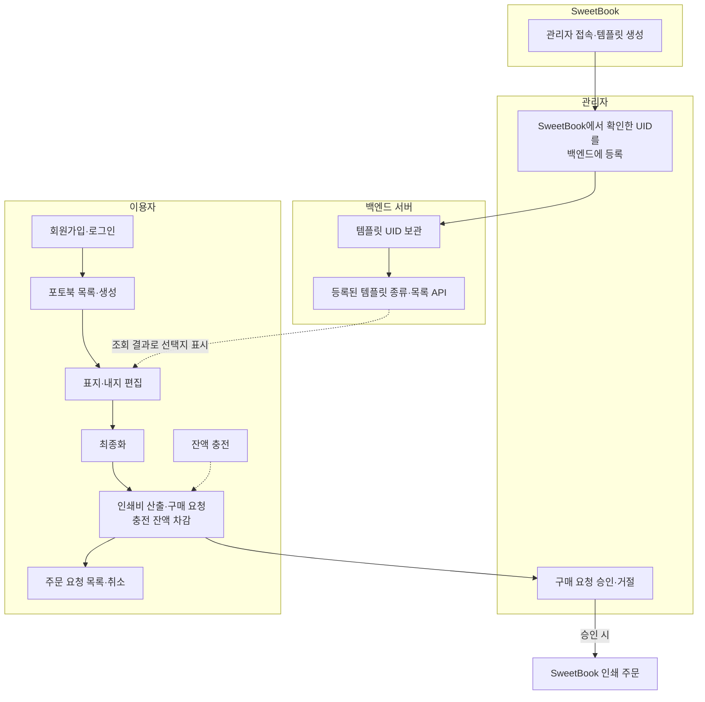

- 템플릿: 관리자가 SweetBook에서 템플릿을 만든 뒤, 확인한 UID를 백엔드에 등록하면 서버가 보관하고, 등록된 종류만 이용자 표지·내지 화면에 목록 API로 내려줍니다.

### 이용자 흐름

이용자와 관리자의 흐름에 알맞게 스크린샷을 제공합니다. 여분을 포함한 사진은 docs/image 에 두었습니다.

#### 1. 메인 페이지

서비스 홈·진입 화면.

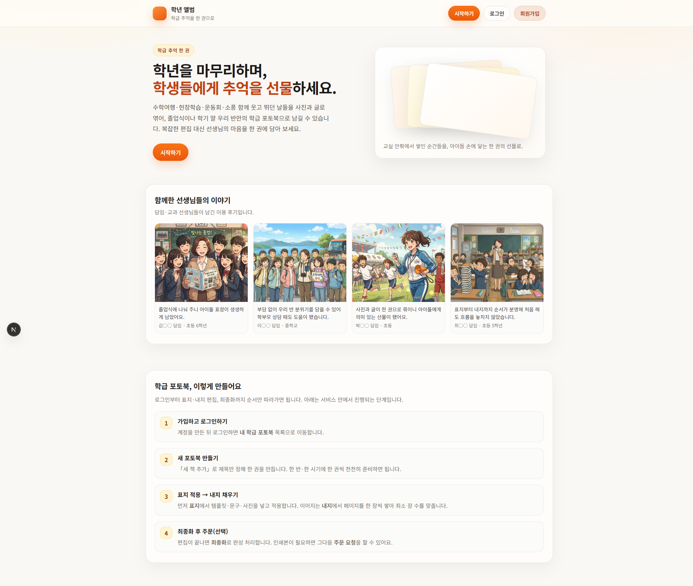

#### 2. 로그인 페이지

회원가입·로그인 후 서비스를 이용하는 화면입니다.

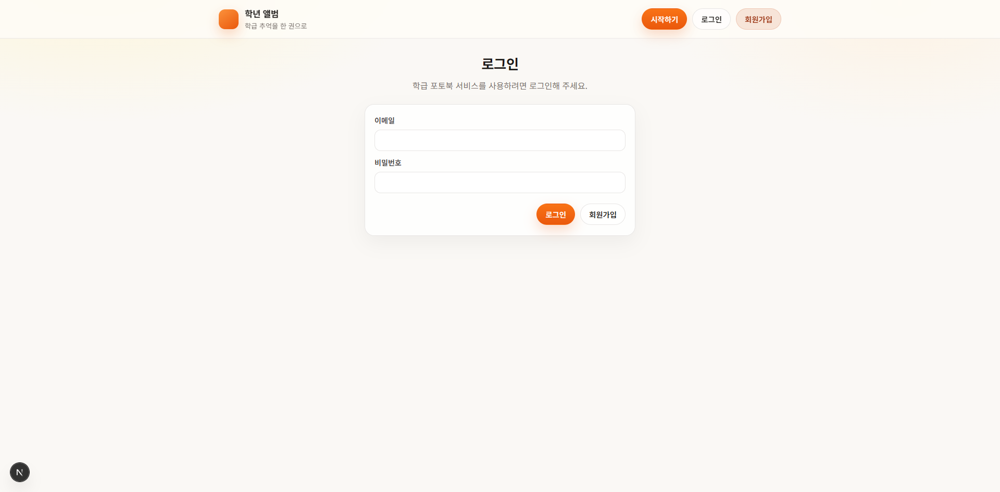

#### 3. 포토북 목록 페이지

만든 포토북을 모아 보는 목록입니다.

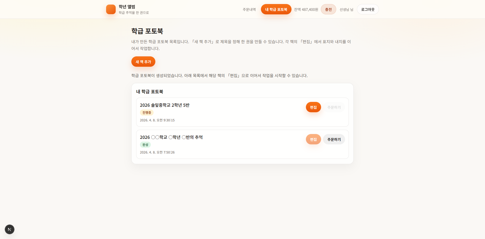

#### 4. 표지·내지 편집

표지·내지 업로드 및 SweetBook 연동 편집 화면입니다. 백엔드에 등록된 템플릿 종류가 선택지로 표시됩니다.

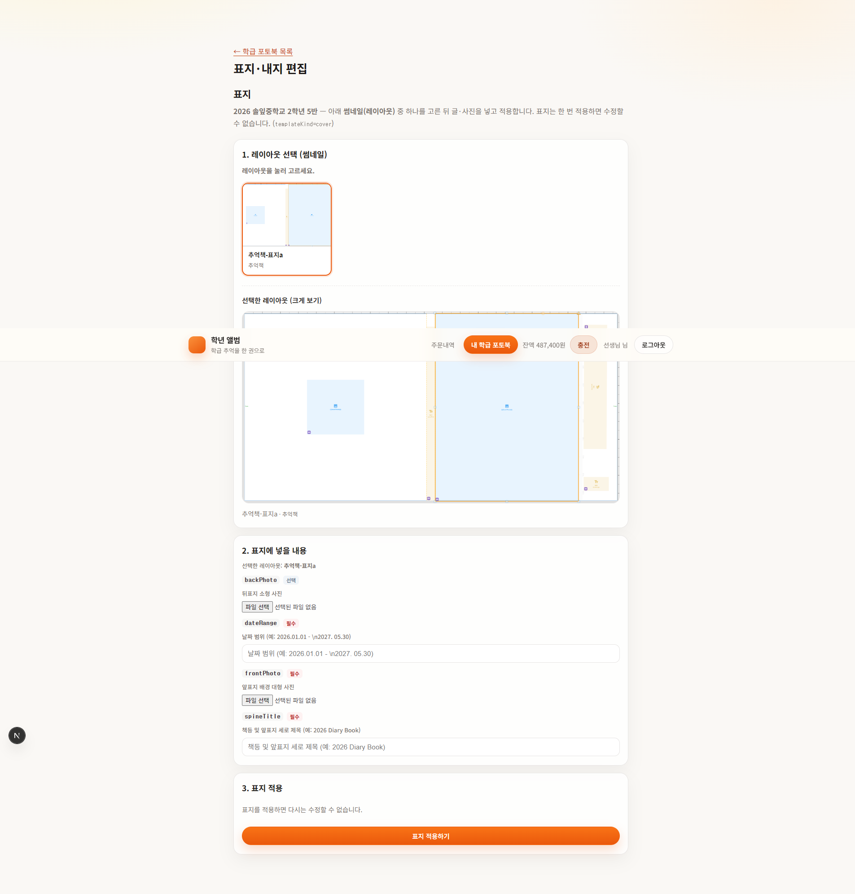

#### 5. 최종화

인쇄 주문 전 책 최종 확정.

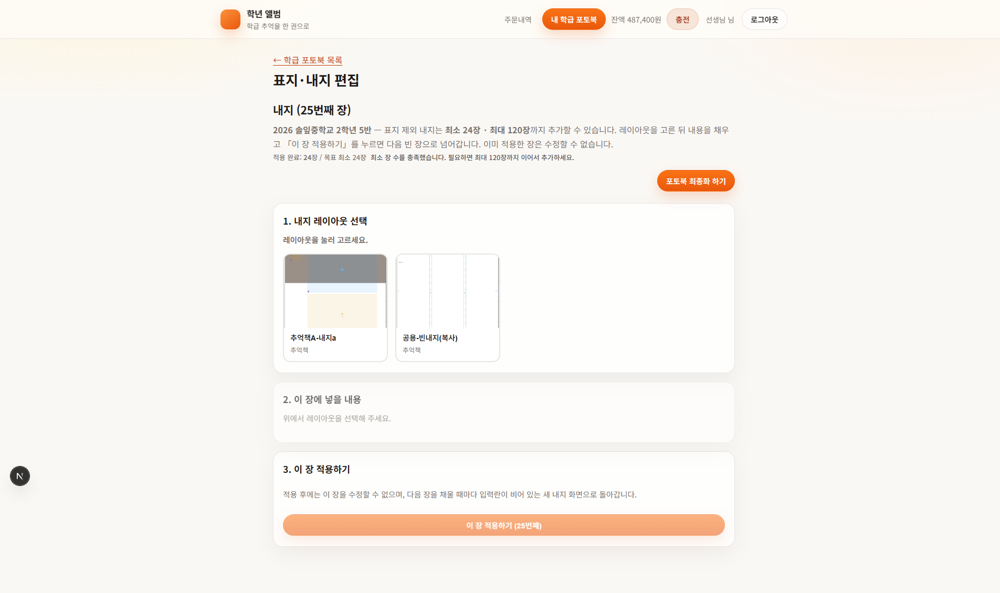

#### 6. 구매·비용 확인

최종화된 책에 대해 인쇄 비용을 확인하고, 충전 잔액으로 구매 요청하는 화면입니다.

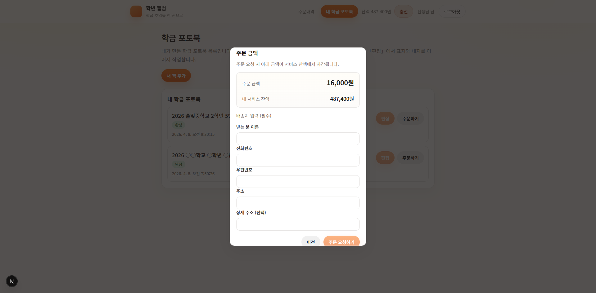

#### 7. 주문(요청) 목록

요청 상태 확인·취소 등을 하는 화면입니다.

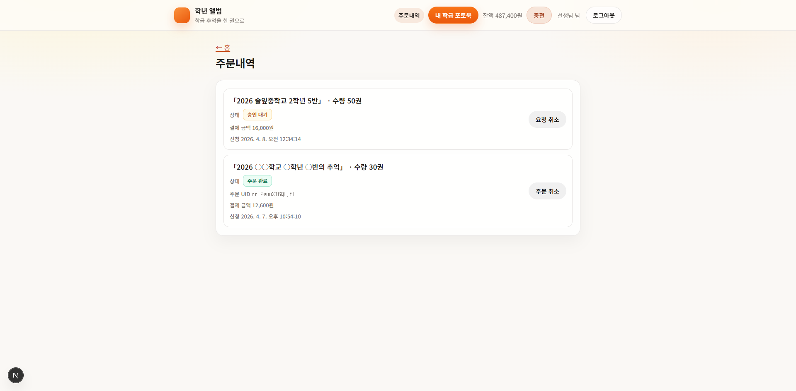

### 관리자 흐름

관리자 전용 화면과, 템플릿을 생성하고 등록해 관리자 페이지에 반영하는 방법을 스크린샷으로 보여 줍니다.

#### 1. 관리자 페이지

`admin` 계정으로 로그인한 뒤 구매 요청·회사 크레딧·레이아웃 템플릿 등을 다루는 화면입니다.

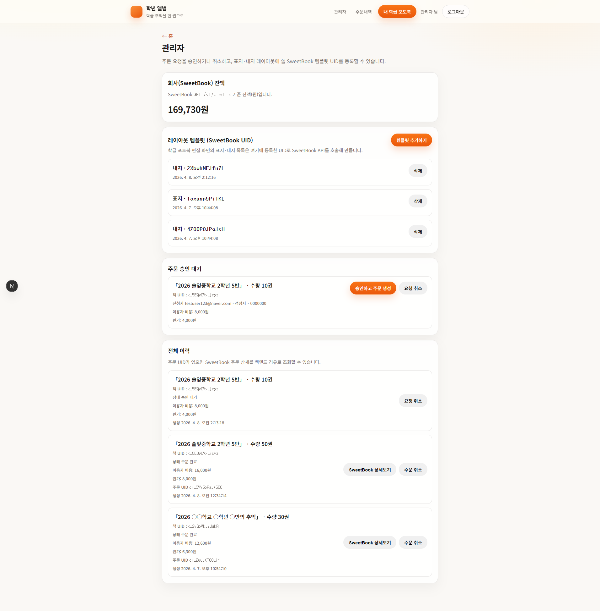

#### 2. SweetBook 내 템플릿 (SweetBook)

SweetBook 쪽에서 표지·내지 템플릿을 생성·관리하는 화면입니다.

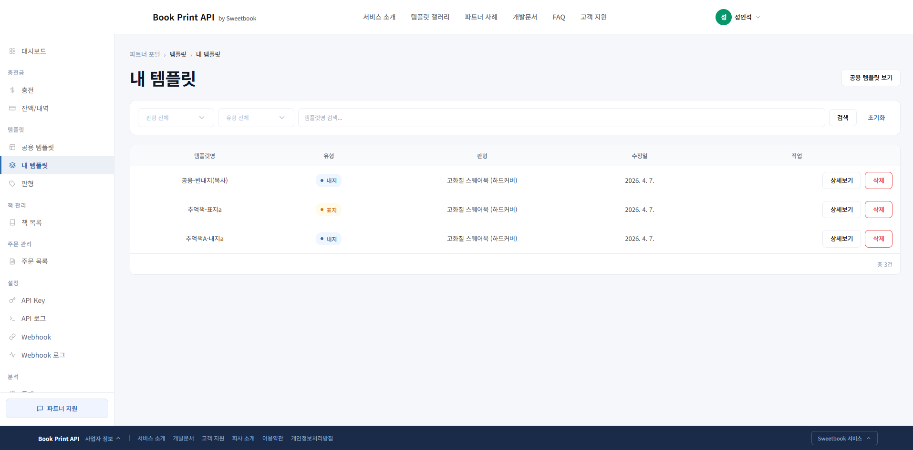

#### 3. 레이아웃 템플릿 등록 (백엔드)

SweetBook 쪽에서 템플릿 UID를 복사하여 관리자 페이지에 등록하는 흐름입니다.

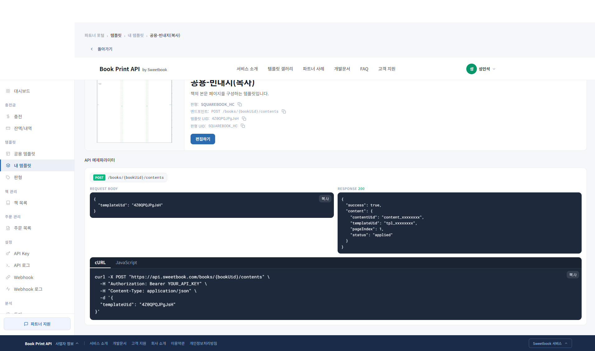