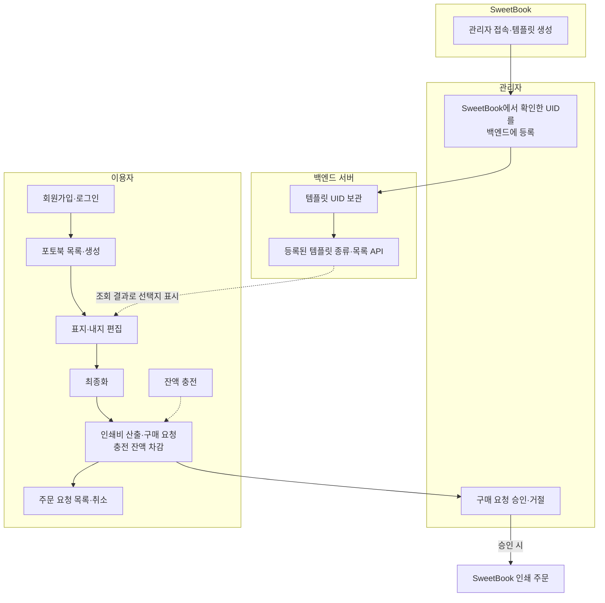

# sweetbook-task-inseok

**서비스 소개**: 선생님이 학급 사진과 글을 한 권으로 묶어, 학생들에게 건네는 졸업·학년 마무리용 포토북을 만들고 인쇄까지 이어 가는 서비스입니다.

**타겟 고객**: 일년 동안의 추억을 담아 학생들에게 선물하고 싶은 선생님.

**주요 기능**

- 회원가입·로그인(JWT), 역할 구분(일반 `user` / `admin`)
- 충전 잔액(`balance_won`): 충전 후 구매 시 차감
- 포토북 생성·목록·상세, 표지/내지 업로드, 최종화(SweetBook 연동)
- 이용자가 최종화한 책을 구매할 때 인쇄 비용을 산출하고, 충전 잔액으로 결제
- 구매 요청 → 관리자 승인 시 SweetBook 주문 생성, 이용자는 요청 목록·취소
- 관리자: 구매 요청 처리, 회사 크레딧 조회, 레이아웃 템플릿 등록
- 등록된 템플릿 UID 기준 표지/내지 선택 UI

## 빠른 실행

### 1) MySQL

백엔드는 MySQL에 붙습니다. **이미 로컬에서 MySQL이 떠 있으면** 그걸 쓰면 되고, 아니면 저장소의 Docker Compose로 MySQL만 띄울 수 있습니다.

```bash
cd ./backend

# mysql이 켜져있지 않다면
docker compose up -d mysql
```

- 기본 포트: 호스트 `3306` → 컨테이너 `3306` (`MYSQL_PUBLISH_PORT`로 바꿀 수 있음)
- 계정·DB 이름은 `backend/docker-compose.yml` / `.env`와 맞춰 `backend/.env`의 `DB_*` 를 설정하세요.

### 2) 백엔드

DB가 떠 있는 상태에서, **백엔드 디렉터리**에서:

```bash
cd ./backend

cp .env.example .env
```

`.env.example`을 그대로 복사해 두었으면 **`SWEETBOOK_API_KEY`만** 채우면 됩니다. 나머지는 예시에 맞춰져 있습니다.

```bash
npm install

npm run start:dev
```

### 3) 시드 데이터 삽입 (새 터미널)

```bash
cd ./backend

npm run seed
```

- API 기본 주소: `http://localhost:3001` (`PORT`로 변경 가능)

### 4) 프론트엔드 (새 터미널)

```bash
cd ./frontend

cp .env.example .env
```

(백엔드 주소가 다르면 `.env`의 `NEXT_PUBLIC_API_BASE_URL` 수정)

```bash
npm install
npm run dev
```

- 브라우저: `http://localhost:3000`


## 폴더 구조

| 경로 | 설명 |
|------|------|
| `backend/` | Nest 앱 — `auth/`, `yearbook/`, `sweetbook/`, `test/`, `entities/`, `scripts/seed.ts` |
| `frontend/` | Next.js 앱 — `app/`, `components/`, `contexts/`, `lib/api.ts` |
| `docs/image/` | **README에 넣을 이미지**를 두는 폴더 (흐름·화면 스크린샷 등) |

### 전체 흐름 (Mermaid)



- **템플릿**: 관리자가 **SweetBook**에서 템플릿을 만든 뒤, 확인한 **UID를 백엔드에 등록**하면 서버가 보관하고, **등록된 종류만** 이용자 표지·내지 화면에 **목록 API**로 내려줍니다.

### 이용자 흐름

이용자와 관리자의 흐름에 알맞게 스크린샷을 제공합니다. (여분을 포함한 사진은 docs/image 에 위치하고 있습니다.)

#### 1. 메인 페이지

서비스 홈·진입 화면.


#### 2. 로그인 페이지

회원가입·로그인 후 서비스 이용.


#### 3. 포토북 목록 페이지

만든 포토북을 모아 보는 목록.


#### 4. 표지·내지 편집

표지·내지 업로드 및 SweetBook 연동 편집 화면. (백엔드에 등록된 템플릿 종류가 선택지로 표시됩니다.)


#### 5. 최종화

인쇄 주문 전 책 최종 확정.


#### 6. 구매·비용 확인

최종화된 책에 대해 인쇄 비용을 확인하고, 충전 잔액으로 구매 요청.


#### 7. 주문(요청) 목록

요청 상태 확인·취소 등.


### 관리자 흐름

관리자 전용 화면과, 템플릿을 생성하고 등록해 관리자 페이지에 반영하는 방법을 스크린샷으로 보여 줍니다.

#### 1. 관리자 페이지

`admin` 계정으로 로그인한 뒤 구매 요청·회사 크레딧·레이아웃 템플릿 등을 다루는 화면.


#### 2. SweetBook 내 템플릿 (SweetBook)

SweetBook 쪽에서 표지·내지 템플릿을 생성, 관리 하는 화면.


#### 3. 레이아웃 템플릿 등록 (백엔드)

SweetBook 쪽에서 템플릿 UID를 복사하여 관리자 페이지에 등록

